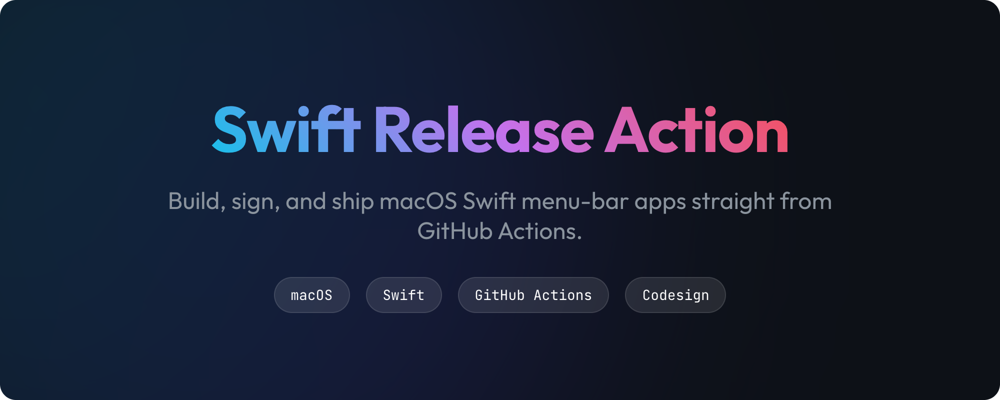
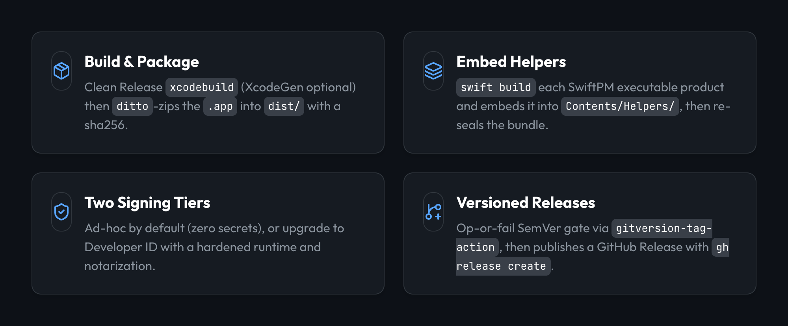
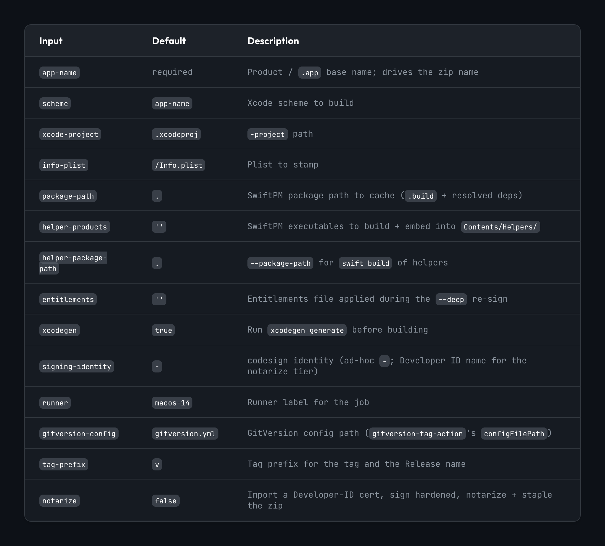
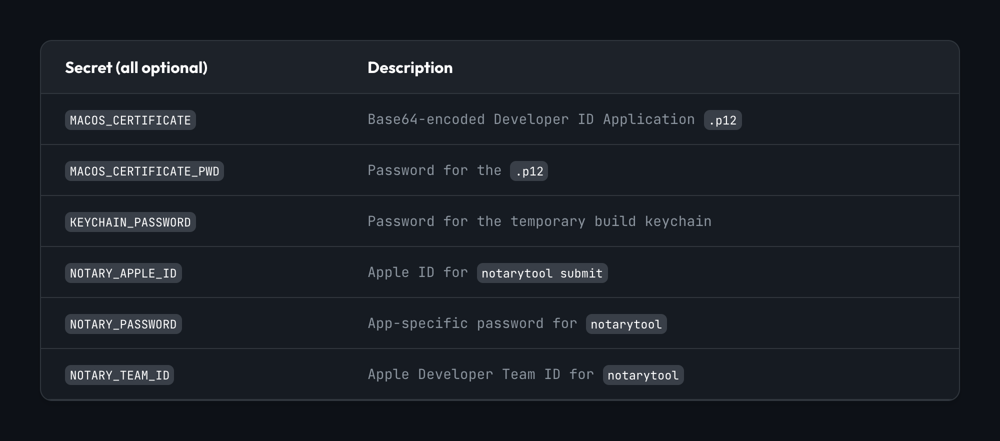
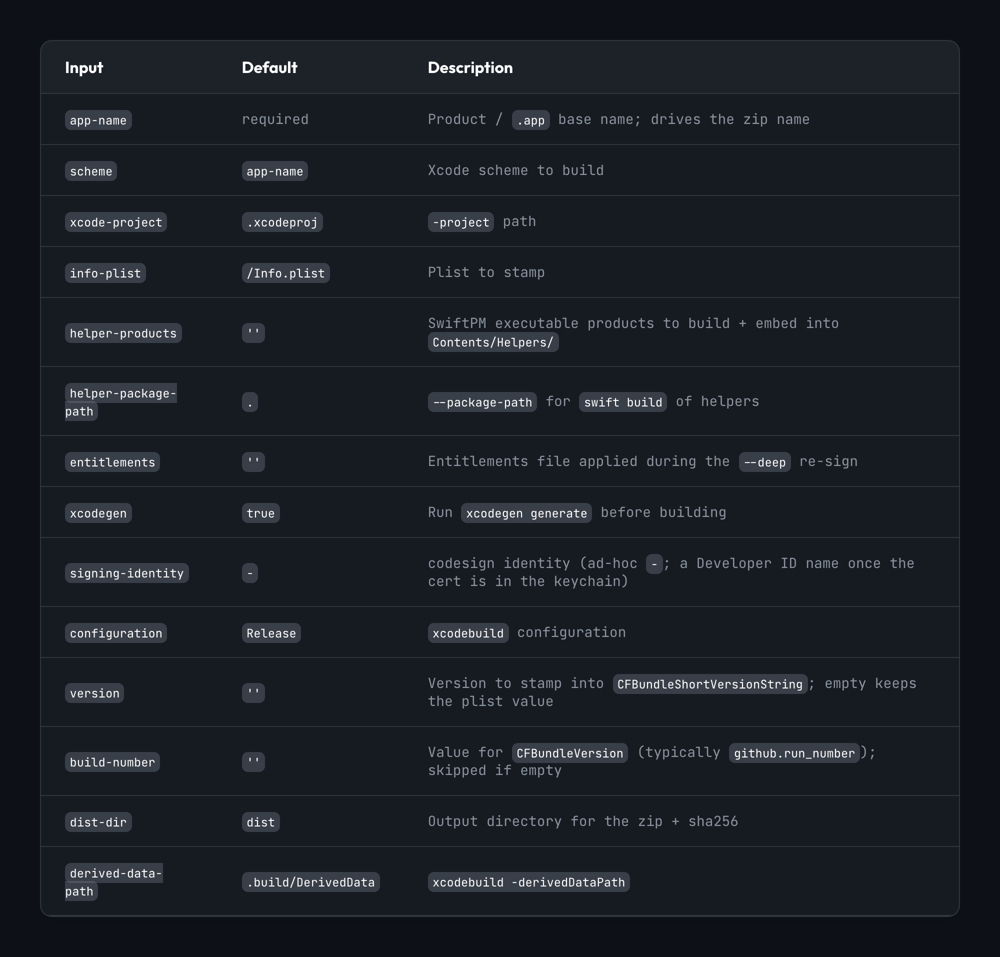
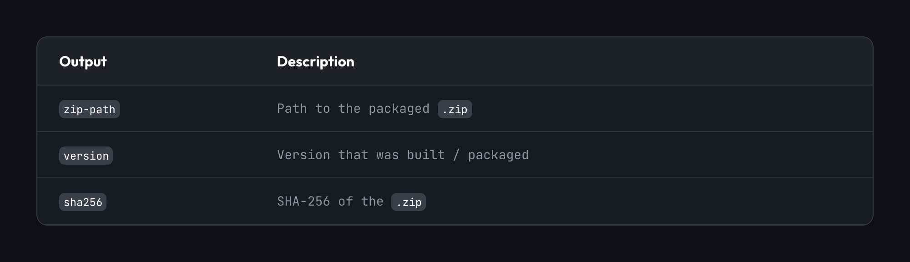

<p align="center">
  
</p>

<p align="center">
  <a href="LICENSE"></a>
  
  
</p>

A reusable macOS Swift app **release pipeline** for the "SwiftKit" pattern
(extracted from [`vhco-pro/ssm-connect`](https://github.com/vhco-pro/ssm-connect)),
shipped two ways:

- **Reusable workflow** (`.github/workflows/release.yml`, `on: workflow_call`) -
  the **primary** way to consume this repo. One macOS job that composes the whole
  release: checkout → compute version & tag → build/sign/package → publish a
  GitHub Release. A consumer pins it with a ~10-line caller (see
  [`examples/release.yml`](examples/release.yml)).
- **Composite action** (`action.yml`) - the pure, secret-free build/sign/package
  step (`version` is an input; no versioning, no Release). The reusable workflow
  calls it; you can also call it directly to build a **custom pipeline** (e.g. a
  CI smoke build).

## Features

<p align="center">
  
</p>

### Op-or-fail release gate

The reusable workflow does **not** invent a "should I release?" flag.
`gitversion-tag-action` computes the next SemVer and then **always** runs
`git tag <prefix><semVer> && git push`. That is op-or-fail and **is** the gate:

- A real version bump → the tag is new → it is created+pushed → the job
  continues to build and publish the Release.
- A no-bump push (chore/docs/style/test/ci) → the SemVer resolves to the
  already-tagged version → `git tag` hits an existing tag → the tag **step
  fails** → the run stops with no build and no Release.

That failure **is** the "nothing to release" signal. There is no synthetic
always-run no-op, and no separate bump-gate output.

## What the build/sign/package step does

The composite action (`action.yml`), invoked by the reusable workflow:

- `xcodegen generate` (optional) → selects the newest installed Xcode (XcodeGen
  emits a project format the runner's default Xcode can be too old to read) →
  clean Release `xcodebuild` (with `-skipPackagePluginValidation`, **required**
  for SwiftPM build-tool plugins like smithy-swift's).
- Stamps the supplied `version` into `CFBundleShortVersionString` and
  `build-number` into `CFBundleVersion` (both optional).
- `swift build -c release` each helper product and embeds it into
  `<App>.app/Contents/Helpers/`, then re-signs.
- `codesign --force --deep` the whole bundle (embedding a binary after Xcode
  signs invalidates the outer seal) and `codesign --verify --deep --strict`.
- `ditto -c -k --sequesterRsrc --keepParent` → `dist/<app>-<version>.zip` + a
  `.sha256`. **Outputs:** `zip-path`, `version`, `sha256`.

### Signing tiers

- **Ad-hoc (default):** identity `-`, no Apple Developer account, **not
  notarized**. Works identically locally and on CI with zero secrets.
- **Developer ID (upgrade):** in a prior caller step, import the cert into a
  temporary keychain, then pass the cert's common name as `signing-identity`.
  The action then re-signs with a secure timestamp and the hardened runtime
  (`--timestamp --options runtime`), as notarization requires. Notarization +
  stapling itself lives in the caller (it needs secrets) - see the example.

It holds **no secrets** and does **no versioning and no Release publishing** -
`version` is an input. Those concerns live one layer up, in the reusable
workflow (which calls the owner's `gitversion-tag-action` and `gh release
create`).

## Usage - reusable workflow (recommended)

Add `.github/workflows/release.yml` to the consuming repo, calling the reusable
workflow as a thin caller (full canonical version in
[`examples/release.yml`](examples/release.yml)):

```yaml
name: Release
on:
  push:
    branches: [main]
    paths-ignore: ['.gitignore', 'README.md', 'LICENSE', 'docs/**']
  workflow_dispatch:

permissions: {}

jobs:
  release:
    permissions:
      contents: write   # reusable workflow pushes the tag + publishes the Release
    uses: vhco-pro/swift-release-action/.github/workflows/release.yml@v1
    with:
      app-name: ClaudeCompanion
      helper-products: claude-companion-helper
      helper-package-path: ClaudeCompanionKit
      package-path: ClaudeCompanionKit
      entitlements: ClaudeCompanion/ClaudeCompanion.entitlements
      xcodegen: true
      signing-identity: '-'
      notarize: false
    secrets: inherit
```

The consumer also needs a `gitversion.yml` at its repo root - copy the
[reference one](gitversion.yml) shipped here (it is reference only; this repo
does not use it for its own releases).

### Reusable workflow inputs

<p align="center">
  
</p>

### Reusable workflow secrets (all optional - notarize tier only)

<p align="center">
  
</p>

With `secrets: inherit` in the caller, defining these in the consuming repo is
enough; omit them all for the ad-hoc tier (`notarize: false`).

## Usage - composite action (custom pipelines)

Call the composite directly when you want your own orchestration (e.g. a CI
smoke build with no Release). `version` is an input; you own versioning and any
Release step:

```yaml
- id: build
  uses: vhco-pro/swift-release-action@v1
  with:
    app-name: ClaudeCompanion
    helper-products: claude-companion-helper
    helper-package-path: ClaudeCompanionKit
    version: 1.2.3            # whatever you computed
    build-number: ${{ github.run_number }}
```

## Inputs (composite action `action.yml`)

<p align="center">
  
</p>

## Outputs

<p align="center">
  
</p>

## Permissions

The reusable workflow sets top-level `permissions: {}` and grants its job
`contents: write` (so `gitversion-tag-action` can push the tag and
`gh release create` can publish the Release). The caller's `release` job must
also declare `permissions: contents: write` for the reusable-workflow call. The
composite action itself needs no special permissions.

## Conventions / requirements in the consuming repo

- Conventional-commit messages on `main` (drive the SemVer bump).
- `gitversion.yml` at the repo root (copy the reference; read by
  `michielvha/gitversion-tag-action`).
- A local SwiftPM package as the dependency source of truth (with a committed
  `Package.resolved`), and a `project.yml` (XcodeGen) rendering the thin app
  target - the established SwiftKit layout.

## Supply-chain hygiene

The reusable workflow SHA-pins its third-party actions (`actions/checkout`,
`actions/cache`); the owner's `gitversion-tag-action` stays `@v6` (a tag the
owner controls). Dependabot (`.github/dependabot.yml`, `github-actions`
ecosystem) keeps the pins fresh.

## Reference & docs

- Spec: [`docs/specs/swift-release-action.spec.md`](docs/specs/swift-release-action.spec.md)
- Plan: [`docs/plans/swift-release-action.plan.md`](docs/plans/swift-release-action.plan.md)

## License

Apache-2.0. See [LICENSE](LICENSE).
